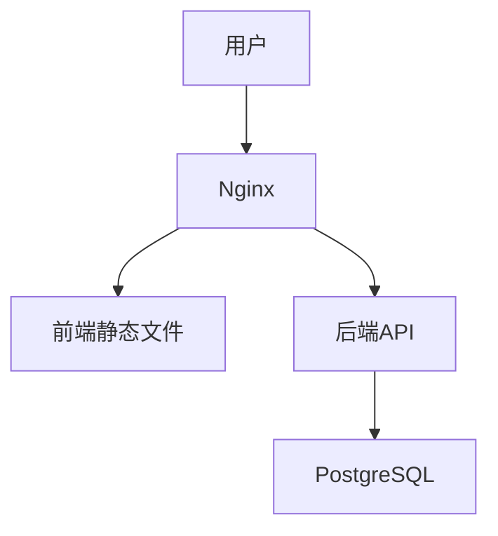

# 构建与部署

## 开发环境

### 启动所有服务
```bash
docker-compose up -d
```

### 单独启动服务
```bash
# 后端
docker-compose up -d backend

# 前端
docker-compose up -d frontend

# 数据库
docker-compose up -d db
```

## 生产环境

### 后端构建
```bash
cd backend-fastapi-app
docker build -t zayum-admin-backend .
```

### 前端构建
```bash
cd frontend-vue-app
docker build -t zayum-admin-frontend .
```

### 生产环境变量配置
```env
# backend-fastapi-app/.env
DATABASE_URL=postgresql://admin:admin123@db:5432/zayum_admin
SECRET_KEY=your-secret-key
```

## 部署架构

### 服务架构图


### 端口说明
| 服务 | 容器端口 | 主机端口 | 说明 |
|------|----------|----------|------|
| 前端 | 80 | 8080 | 用户界面 |
| 后端 | 8000 | 8000 | API服务 |
| 数据库 | 5432 | 5432 | PostgreSQL |

## 性能优化

### 后端配置
```ini
; supervisor/conf.d/backend.conf
[program:backend]
command=uvicorn app.main:app --host 0.0.0.0 --port 8000 --workers 4
```

### 前端配置
```nginx
# nginx.conf
server {
    gzip on;
    gzip_types text/plain text/css application/json application/javascript;
    
    location / {
        try_files $uri $uri/ /index.html;
    }
}
```

## 监控与维护

### 查看日志
```bash
# 后端日志
docker-compose logs -f backend

# 前端日志 
docker-compose logs -f frontend
```

### 数据库备份
```bash
docker exec -t zayum-admin-db pg_dump -U admin zayum_admin > backup.sql
